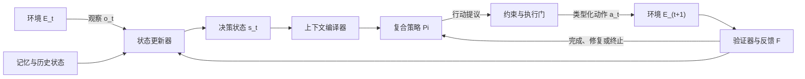

> 监督学习常被概括为学习一个从输入（X）到输出（Y）的映射，而 Agent 系统面对的并不是一次性的映射问题，而是在不完全信息、外部反馈与资源约束下持续决定“下一步做什么”。如果不同的 Agent 框架确实共享某种稳定结构，那么这种结构首先应该出现在运行闭环中，而不是出现在某个框架的类名、消息格式或工作流语法里。

## 摘要

近年来，围绕大语言模型构建的 Agent 框架迅速增多。LangGraph、AutoGen、CrewAI、OpenAI Agents SDK、SmolAgents 以及各种自研 Runtime，在状态表达、工具调用、消息协议、工作流编排和记忆机制上存在明显差异。这些差异容易使人产生一种印象：LLM Agent 仍然只是若干工程技巧的集合，尚不存在可跨模型、跨框架讨论的共同范式。

本文提出另一种观察方式。与其横向比较不同框架提供了哪些组件，不如纵向追问：一个系统要成为能够持续行动的 Agent，最低限度需要维持什么闭环？强化学习中的 Agent—Environment Interface 为这个问题提供了重要起点，但它不能未经修正地直接套用到 LLM Agent 上。经典强化学习通常以状态、动作、状态转移、奖励与策略描述序列决策；部署态 LLM Agent 则经常运行在部分可观测、异步、非平稳的开放环境中，其反馈也不一定是可优化的标量奖励，而可能是工具结果、规则校验、自然语言批评、用户确认或安全约束。

基于这一差异，本文尝试将 Agent Runtime 抽象为五个相互作用的要素：**State、Policy、Action、Environment 与 Feedback**。其中，State 表示当前决策所依赖的有效状态，Policy 表示从状态到行动提议的复合决策过程，Action 表示系统能够实施的类型化操作，Environment 表示行动真正作用并产生后果的外部世界，Feedback 则表示系统对行动结果的评价、约束与修正信号。Reward 可以被视为 Feedback 的一种特殊形式，但二者不能简单等同。

这一抽象的价值不在于证明“LLM Agent 就是强化学习 Agent”，而在于提供一种模型无关、框架无关的描述语言。借助它，我们可以更准确地解释上下文、记忆、规划、反思、工具、多 Agent 与评估器分别位于系统的哪一层，也可以把框架比较从功能清单转化为接口比较，把 Agent 调试从模糊的“模型表现不好”转化为可定位的状态、策略、动作、环境与反馈故障。本文最后进一步讨论：这套抽象距离真正的统一理论还缺少什么，以及哪些命题可以被工程实验验证。

## 一、Agent 研究需要的不是更多组件清单，而是共同坐标系

当前关于 Agent 框架的讨论，大多从工程表面开始：某个框架是否支持图结构编排，是否内置多 Agent 通信，是否提供长期记忆，能否流式调用工具，是否方便接入人工审批。这样的比较对于技术选型当然有价值，但它只能说明框架“提供了什么”，无法解释这些机制为何存在，也很难说明两个实现完全不同的系统是否在解决同一个问题。

更根本的问题是：当一个大语言模型从文本生成器变成 Agent 时，系统究竟增加了什么？答案不只是工具调用，因为一次函数调用并不足以构成持续行动；也不只是规划，因为没有环境反馈的规划仍然可能停留在内部文本；更不只是记忆，因为保存历史并不会自动产生正确决策。Agent 的关键变化在于，模型被放进了一个反复运行的闭环：它观察环境，形成当前状态，选择行动，接收结果，再据此更新后续决策。

因此，Agent 的共同结构更可能存在于运行时语义，而不是框架 API 中。图编排框架、对话式多 Agent 框架、工具中心框架与代码执行型 Agent，虽然使用不同的数据结构和控制方式，但都必须回答五类问题：系统当前知道什么，下一步如何决定，能够执行哪些操作，操作会改变什么，以及如何判断行动是否有效。只要这些问题无法被回答，系统就很难具备稳定的闭环行为；只要这些问题可以被统一描述，不同框架就获得了可比较的共同坐标系。

## 二、强化学习提供的是交互闭环，而不是现成答案

强化学习为 Agent 研究提供了最成熟的形式化语言之一。在经典马尔可夫决策过程（Markov Decision Process，MDP）中，环境通常表示为：

```text
M = (S, A, P, R, gamma)
```

其中，`S` 是状态空间，`A` 是动作空间，`P` 是状态转移规律，`R` 是奖励函数，`gamma` 是折扣因子；Agent 通过策略 `pi(a|s)` 在给定状态下选择动作，并试图最大化长期累积回报。Sutton 与 Barto（2018）所强调的 Agent—Environment Interface，则把这一过程呈现为一个持续循环：环境向 Agent 提供状态或观察，Agent 向环境施加动作，环境随后产生新的状态与奖励。

需要澄清的是，`(State, Policy, Action, Environment, Reward)` 并不是强化学习教材给出的标准 MDP 元组，而是一种从 Agent—Environment 交互界面中提炼出来的系统视角。这个区分并非术语洁癖，因为“用于描述环境的问题形式”与“用于描述 Agent Runtime 的系统组成”并不是同一件事。前者关心一个序列决策问题如何被数学定义，后者关心一个真实软件系统如何感知、决策、执行、校验并继续运行。

对于 LLM Agent，更接近现实的起点通常不是完全可观测的 MDP，而是部分可观测决策过程。在复杂软件环境中，Agent 无法直接读取世界的完整真实状态，只能获得网页内容、工具返回、文件片段、数据库查询结果、用户消息或其他 Agent 的通信。这些内容是 observation，而不是环境状态本身。系统必须结合历史、记忆和已有产物，构造一个用于当前决策的内部状态；一旦这个内部状态遗漏关键约束、混入过期事实或错误压缩证据，后续策略即使足够强，也会在错误的问题表述上作出选择。

因此，强化学习真正提供的不是“LLM Agent 已经被解释完毕”，而是一种重要的结构直觉：智能行为不是孤立输出，而是行动与反馈构成的时间过程。LLM Agent 可以沿用这一闭环，但必须重新定义状态如何构造、策略由哪些组件组成、行动如何被约束，以及奖励概念在部署态系统中应当如何扩展。

## 三、五要素统一抽象：从模型调用转向受控状态演化

为了描述一个实际运行的 LLM Agent，可以将其抽象为：

```text
Agent Runtime = (S, Pi, A, E, F)
```

这里的 `S` 是决策状态（State），`Pi` 是复合策略（Policy），`A` 是动作空间（Action Space），`E` 是环境（Environment），`F` 是反馈与目标机制（Feedback / Objective）。五个要素并不是彼此独立的模块清单，而是通过明确接口形成闭环。一个简化的单步运行过程可以写成：

```text
o_t       = Observe(E_t)
s_t       = Update(s_(t-1), o_t, a_(t-1), f_(t-1))
c_t       = Compile(s_t, goal, budget)
a_t       ~ Pi(a | c_t, available_actions, constraints)
E_(t+1)   = Transition(E_t, a_t)
f_t       = Verify(goal, trace_t, artifacts_t, E_(t+1))
```

这组表达式揭示了一个经常被忽略的事实：模型实际接收到的上下文 `c_t` 并不等于系统状态 `s_t`，而是状态在目标、权限与上下文预算约束下的一次编译结果。类似地，模型产生的行动提议也不应直接等于最终执行动作；在可靠系统中，它通常还要经过参数校验、权限检查、幂等控制、人工审批或安全策略，然后才会真正改变环境。



从这个视角看，Agent 不是一个会自主说话的模型，而是一个让状态在观察、行动与反馈中持续演化的受控系统。大语言模型可以承担其中最重要的语义决策，但 Runtime 必须负责保存状态、限制动作、管理副作用、登记证据、执行验证并决定何时停止。统一抽象的核心因此不是“所有 Agent 都用了同一种模型”，而是“所有可靠 Agent 都必须以某种方式闭合这一运行循环”。

## 四、State 不是 Context：状态是决策语义，上下文只是模型输入

在 LLM 系统中，State、Context、Memory、Observation 与 Artifact 经常被混用，这会直接削弱架构讨论的精度。它们之间更合理的关系是：Observation 是环境在某一时刻暴露给系统的信息；Memory 是跨步骤或跨任务保存信息的机制；Artifact 是由行动产生并可被外部访问的持久对象；State 则是系统认为当前决策必须依赖的有效信息集合；Context 最后才是为了调用特定模型而序列化出来的输入。

| 概念 | 核心问题 | 在运行闭环中的位置 |
| --- | --- | --- |
| Observation | 环境刚刚暴露了什么 | 从 Environment 进入系统的输入 |
| Memory | 哪些信息需要跨步骤保存与检索 | State 的持久化来源，也可能物理存在于 Environment |
| Artifact | 行动产生了哪些可检查、可复用的对象 | Environment 中的持久结果，引用可进入 State |
| State | 当前决策究竟依赖哪些有效事实、目标与约束 | Policy 的语义输入 |
| Context | 本次模型调用实际看到了什么 | State 经过筛选、排序、压缩和序列化后的投影 |

这一区分延续了“长上下文不是记忆”的判断。上下文窗口扩大，只意味着模型调用可以容纳更多 Token，并不意味着系统拥有了更准确的状态。真正的 State 必须处理信息有效期、来源、冲突、优先级、依赖关系与版本；Context Compiler 则根据当前子任务，把这些结构化状态编译成有限输入。如果系统只是把消息历史、工具日志和检索文档不断追加到 Prompt 中，那么它拥有的是越来越大的输入仓库，而不是越来越可靠的工作状态。

Memory 的归属也需要从逻辑层与物理层分别理解。在逻辑层面，一条被检索并参与决策的记忆属于 State；在物理层面，向量数据库、文件系统或知识图谱位于 Agent 之外，应被视为 Environment 的一部分。Artifact 同样具有双重性：完整报告、代码文件或实验数据通常保存在环境中，而它们的路径、摘要、校验结果和依赖关系进入 State。这样的区分能够避免把所有持久化对象都塞进模型上下文，也能说明为什么“拥有记忆数据库”并不等于“Agent 在当前步骤使用了正确记忆”。

## 五、Policy 不等于 Prompt，也不等于 LLM

把 LLM 称为 Agent 的 Policy 是一个有用近似，但如果把二者完全等同，就会忽略 Runtime 对决策行为的深刻影响。在最简单的 ReAct 式循环中，模型根据上下文生成推理文本和下一步动作，LLM 确实承担了主要的动作选择功能。然而在生产系统中，最终 Policy 往往由多个部分共同构成：模型及其参数、系统提示词、上下文编译规则、可用工具集合、模型路由、工作流图、采样策略、重试逻辑、权限约束、预算控制、人工审批与终止条件都会改变系统在同一状态下选择什么动作。

因此，更准确的表达不是：

```text
Policy = Prompt
```

也不宜简单写成：

```text
Policy = LLM(prompt, state)
```

而应理解为：

```text
Context_t = ContextCompiler(State_t, Goal, Budget, Permissions)

ActionProposal_t = LLM(
    Context_t,
    ToolSchemas_t,
    PolicyInstructions,
    DecodingConfig
)

Action_t = Controller(
    ActionProposal_t,
    WorkflowState,
    Constraints,
    ApprovalPolicy
)
```

在这个表达中，LLM 是 Policy 的核心语义组件，但不是完整 Policy。工作流图可以限制下一步允许进入哪些节点，工具权限可以缩小动作空间，Context Compiler 可以改变模型看到的状态，Controller 可以拒绝不合规的行动提议，而 Stop Policy 决定系统是否继续消耗预算。两个系统即使使用相同模型和相同 Prompt，只要这些外围机制不同，就可能表现出完全不同的可靠性、成本与失败模式。

这也解释了为什么所谓 Prompt Engineering 只是策略工程的一部分。Prompt 决定模型如何解释当前输入，却不负责保证状态完整、动作合法、环境副作用可恢复或结果已经通过验证。将 Policy 提升为系统级概念之后，Agent 工程的重点便从“如何写一句更聪明的提示词”转向“如何设计一个在约束条件下稳定产生下一步行动的决策程序”。

## 六、Tool 不是 Action：工具定义能力，调用才是行动

工具与行动之间也存在类似的层级差异。Tool 描述系统可以借助什么能力改变或观察环境，Tool Call 才是某一时刻带有具体参数的行动实例。搜索工具定义了检索能力，`search(query="...")` 是一次认识性行动；文件编辑器定义了修改能力，针对具体路径提交补丁才是会产生持久副作用的外部行动。

从统一抽象看，LLM Agent 的动作空间至少可以分成四类。第一类是认识性行动，例如搜索、读取、查询和检查，它们的目标是减少不确定性；第二类是外部行动，例如写文件、发送消息、更新数据库或执行部署，它们会改变环境；第三类是内部控制行动，例如更新计划、写入记忆、切换子任务或请求另一个 Agent 协作，它们改变 Runtime 的后续路径；第四类是终止行动，例如提交最终结果、声明无法完成或请求人工接管。

这种分类的工程意义在于，不同动作需要不同契约。认识性行动关注来源、覆盖率与新鲜度，外部行动关注权限、幂等性、事务与回滚，内部控制行动关注状态一致性，终止行动则需要满足完成条件与证据门槛。如果只把所有动作都表示成无差别的文本或函数调用，Runtime 就很难判断什么操作需要审批、什么失败可以重试、什么结果必须写回状态，以及什么副作用已经不可逆。

## 七、Environment 不只是 API，而是所有真实后果发生的地方

在许多 Agent 架构图中，Environment 被简化成一组 API 或工具服务，但真实环境远比这一描述复杂。用户、文件系统、数据库、网页、编译器、代码仓库、远程服务、其他 Agent、组织流程、权限系统和时间本身，都可能属于环境。一个动作是否成功，不只取决于工具接口是否返回 `200`，还取决于外部状态是否发生了预期变化，以及这种变化是否仍满足任务约束。

环境边界并不是固定的，它取决于系统分析的层级。对于单个模型调用，Prompt 中的一切都可以被看作输入环境；对于 Agent Runtime，消息历史可能属于内部 State，而数据库仍属于外部 Environment；对于多 Agent 系统，一个子 Agent 又可能被上层 Orchestrator 当作环境中的可调用能力。统一抽象并不要求所有系统画出相同边界，而是要求边界一旦确定，就必须明确观察、行动与副作用如何跨越边界。

LLM Agent 的环境还经常具有非平稳、异步和部分可观测特征。网页可能在运行过程中变化，API 可能限流，用户可能撤回授权，另一个 Agent 可能同时修改共享文件，工具返回也可能只暴露真实结果的一部分。正因如此，Runtime 不能假设“动作执行完成”就等于“环境已经进入预期状态”，而应该通过后置检查、版本号、幂等键、事务记录或 artifact 校验确认实际后果。

## 八、Reward 不等于 Feedback：得到评价不意味着发生学习

原始五要素中的 Reward 是最需要修正的部分。在强化学习中，奖励通常是环境返回的标量信号，策略学习算法利用它估计回报并更新行为，使 Agent 在长期意义上最大化目标。然而，大量部署态 LLM Agent 在一次任务运行中并不会更新模型参数，也不存在严格定义的长期回报。它们接收到的往往是工具错误、测试结果、规则违反、用户批评、自然语言反思、人工确认或评分器结论。把这些信号全部称为 Reward，会掩盖它们在表示形式与作用机制上的差异。

因此，运行时抽象更适合使用广义的 Feedback / Objective。Feedback 可以是标量分数，也可以是结构化验证结果、布尔约束、错误类型或自然语言建议；Objective 则说明系统试图满足什么目标，以及多个目标之间如何权衡。Reward 是其中能够被优化算法直接消费的一种特殊反馈，但并不是所有反馈都会自动变成奖励，更不会自动更新 Policy。

这里至少要区分四个环节：Observation 描述发生了什么，Evaluation 判断结果好不好，Feedback 将判断反馈给系统，Learning Update 才决定策略如何变化。在许多反思型语言 Agent 中，反馈先被转换为文字总结，再写入情景记忆，下一次运行通过上下文影响决策。Reflexion（Shinn et al., 2023）展示的正是这种不更新模型权重、而通过语言反馈和记忆改变后续行为的路径。它产生了运行时适应，但不等于传统意义上的参数化强化学习。

因此，“Feedback 最终都会进入 State”只能作为有条件的工程描述。只有被记录、筛选并写入状态的反馈，才会影响后续决策；未被消费的评分不会产生任何作用，错误反馈还可能污染状态。一个可靠 Runtime 不仅要有反馈源，还要定义反馈的可信度、证据、适用范围、有效期与修复动作。

## 九、LLM 是一种新的 Policy 实现

现在可以更准确地回答文章的核心问题。LLM 确实可以被视为一种新型 Policy 实现：它根据语言化状态与动作描述，利用预训练知识、上下文学习和推理过程产生行动。在 ReAct（Yao et al., 2023）中，推理与行动被交替生成，外部观察又进入下一轮推理，这与序列决策闭环高度一致；在工具型 Agent 中，模型从类型化工具集合中选择下一步操作，也可以自然地写成条件动作分布。

但“可以投影到同一交互接口”不等于“二者完全等价”。经典强化学习关注策略如何通过环境交互与奖励信号得到优化，而许多 LLM Agent 的基础 Policy 主要来自离线预训练，部署时权重保持不变。它们依靠提示词、检索、记忆、搜索或工作流约束进行上下文内适应，而不是通过在线梯度更新完成策略学习。此外，LLM 内部包含从大规模语料获得的隐式世界知识，可以在尚未与当前环境充分交互时进行预测和规划，这也不同于许多从任务环境中逐步学习的经典设定。

语言 Agent 的观察和动作空间通常还是开放且组合化的。自然语言反馈无法天然压缩成单一标量，工具参数也可能具有复杂类型；现实任务的真实状态往往不可完全观察，Runtime 构造的状态也很难满足严格的马尔可夫性质。多步推理、程序生成和树搜索则可能发生在一次外部行动之前，相当于 Policy 内部包含了一个计算预算可变的规划过程。

因此，最稳妥的结论是：**LLM Agent 与强化学习 Agent 共享序列决策的运行接口，但不必共享相同的训练机制、状态假设和反馈形式。** LLM 可以成为 Policy 的核心实现，世界模型与符号化规划可以作为 Policy 内部计算；然而，一套完整的 LLM Agent 仍然需要 Runtime 来构造状态、约束行动、连接环境并验证结果。这个判断保留了统一抽象的解释力，也避免把相似的闭环误写成严格的理论等价。

## 十、Memory、Planning、Reflection 与 Multi-Agent 应该放在哪里

当五要素确定之后，Agent 领域常见的功能模块可以被重新放回运行闭环。它们并不是与五要素并列的新“基本粒子”，而是五要素的内部机制、跨层接口或特定实现。

| 常见概念 | 在统一抽象中的主要位置 | 更准确的解释 |
| --- | --- | --- |
| Memory | State + State Update + 外部持久化环境 | 保存信息不是目的，关键是何时写入、检索、失效并进入决策状态 |
| Planning | Policy 内部计算，也可显式写入 State | 规划可以只在一次模型调用中发生，也可以形成可检查、可修订的持久计划 |
| Reflection | Feedback Processing + State Update | 将结果评价转化为后续决策可用的修正信息 |
| RAG | Observation Acquisition + Context Compilation | 从外部知识环境获取候选证据，并编译进当前模型上下文 |
| Tool Use | Action Space + Environment Adapter | 工具定义可用能力，具体调用构成行动并产生环境后果 |
| Workflow | Policy Constraint + State Transition | 用显式图、节点和条件限制可能的决策路径 |
| Multi-Agent | Factored Policy + Communication Actions + Shared Environment | 多个决策单元通过消息和共享状态协作，不自动保证整体状态一致 |
| Guardrail | Action Constraint + Feedback | 在执行前阻止违规动作，或在执行后生成约束反馈 |
| Evaluator | Feedback / Objective | 基于 trace、artifact 与环境状态判断目标是否满足 |

这张表也说明了为什么“Memory、Planning、Reflection、Feedback”并不适合作为彼此平行的 Agent 四模块。Planning 主要属于决策过程，Memory 主要属于状态维护，Reflection 是反馈转化为状态更新的一种方法，而 Feedback 本身来自环境或评价机制。它们在软件实现中可以被拆成独立服务，但在理论抽象中承担的是不同层级的职责。

这一判断并非与既有语言 Agent 架构研究割裂。CoALA（Sumers et al., 2024）已经从认知架构角度提出模块化记忆、结构化动作空间与广义决策过程，用来统一语言 Agent 中的推理、学习与行动；Generative Agents（Park et al., 2023）则通过记忆流、检索、反思与规划展示了长期经验如何参与后续行为。本文与这些工作的共同点，是拒绝把语言模型本身视为完整 Agent；区别在于，本文更关注可部署 Runtime 的系统边界，将 Environment 与 Feedback 提升为显式接口，并进一步把状态编译、动作授权、环境副作用、验证和停止条件纳入同一个工程闭环。

尤其需要注意的是，多 Agent 并不会突破这套抽象。多个 Agent 可以被建模为多个 Policy 对各自局部 State 作出行动，也可以被上层视为一个具有联合状态与联合动作的整体 Agent。真正困难的部分不在于增加角色名称，而在于定义哪些状态共享、通信是否可靠、冲突如何解决、全局目标如何分解，以及局部反馈是否与系统目标一致。换句话说，多 Agent 增加的是状态和策略的因子化复杂度，而不是创造了一个完全不同的基本范式。

## 十一、框架之间真正不同的，是五类设计选择

建立共同坐标系之后，框架比较就不必停留在“谁支持哪些功能”。不同框架的核心差异，可以转化为五类更稳定的设计问题。

| 维度 | 需要比较的问题 | 常见失败 |
| --- | --- | --- |
| State | 状态是否类型化、可版本化、可恢复；历史如何压缩，冲突如何处理 | 过期信息继续生效，关键约束丢失，多个节点状态不一致 |
| Policy | 决策由模型、图结构、规则还是人工共同控制；可用动作如何动态限制 | 模型承担过多控制责任，Prompt 变化引发不可见行为漂移 |
| Action | 动作是否类型化，是否声明前置条件、副作用、幂等性与权限 | 重复执行、参数错误、越权操作、失败后无法恢复 |
| Environment | 如何观察外部变化，如何处理异步、并发与非平稳性 | 工具返回成功但真实状态未更新，共享资源发生竞态 |
| Feedback | 谁来验证结果，反馈是否有证据，如何触发修复或终止 | 评分器误判、反思污染记忆、系统无限重试或过早结束 |

图结构框架通常更强调显式状态转移和控制流，对可恢复工作流更友好；对话式多 Agent 框架更强调角色通信与消息历史，适合协作表达，但需要额外处理共享状态与目标一致性；工具中心框架倾向于让模型直接选择行动，原型简洁，但动作约束与反馈验证往往需要外部补充；代码执行型 Agent 则提供更开放的动作空间，同时也对隔离、权限、事务和 artifact 校验提出更高要求。

这些差异并不能通过“哪个框架更先进”一概而论。真正合理的问题是：目标任务需要怎样的状态一致性，需要多强的控制流约束，哪些动作具有不可逆副作用，环境变化有多频繁，反馈能否自动验证。统一抽象并不消除框架差异，而是把差异从品牌与语法层面推进到系统语义层面。

## 十二、从概念抽象走向工程，需要五类接口契约

一套抽象只有能够约束实现，才不只是概念上的重新命名。要把五要素落到 Agent Runtime 中，每个要素都应具有可检查的接口契约。

State Contract 应定义状态模式、字段来源、更新规则、版本、有效期与不变量。状态变化最好由明确的 reducer 或 transition function 完成，而不是让每个节点随意改写共享对象。对于关键事实，还应记录证据指针与冲突状态，使系统能够区分已核验信息、来源冲突和待核实推断。

Policy Contract 应定义决策输入、可用动作、预算、约束和输出格式。Policy 的输出应当是类型化的行动提议，而不是一段需要 Runtime 猜测意图的自由文本。工作流、模型路由、工具可见性与人工审批策略都应被版本化，因为它们共同决定实际行为。

Action Contract 应至少包含动作名称、参数模式、前置条件、权限要求、预期副作用、超时、幂等策略与结果模式。对于不可逆动作，还需要确认门或补偿策略。工具只返回“成功”通常不够，Runtime 还应知道成功意味着哪个环境状态已经改变，以及如何验证这一变化。

Environment Contract 应定义可观测边界、身份与权限、并发模型、事务语义和失败模式。外部系统可能返回陈旧结果、部分结果或暂时性错误，Runtime 必须知道哪些结果可以重试，哪些需要重新观察，哪些已经产生副作用而不能简单重放。

Feedback Contract 则应定义评价目标、证据来源、严重程度、置信度、适用范围与后续动作。一个测试失败可以触发局部修复，一个权限违规应立即终止，一条低置信度的语言批评可能只适合进入候选记忆，而不能直接覆盖已验证状态。反馈只有与修复、学习或停止机制连接，才真正进入闭环。

将这些契约组合起来，一个更接近生产系统的 Runtime 主循环可以表示为：

```text
while not stop_condition(state, budget):
    observation = environment.observe()
    state = state_reducer.update(state, observation)

    context = context_compiler.compile(
        state=state,
        goal=goal,
        budget=budget,
        permissions=permissions
    )

    proposal = policy.propose(context, available_actions)
    action = action_gate.validate_and_authorize(proposal)
    result = environment.execute(action)

    feedback = verifier.evaluate(
        goal=goal,
        action=action,
        result=result,
        artifacts=artifacts,
        trace=trace
    )

    trace.append(observation, state, action, result, feedback)
    state = state_reducer.update(state, result, feedback)
```

这段伪代码最重要的地方不是具体语法，而是每次模型调用都被放在状态编译、动作授权、环境执行与结果验证之间。模型负责提出有语义价值的下一步，系统负责确保这一步建立在正确状态上、落在允许的动作空间内，并且其结果能够被观察和验证。

## 十三、统一抽象如何改变调试、评估与框架选型

没有统一坐标系时，Agent 失败经常被笼统归因于“模型不够聪明”或“Prompt 不够好”。五要素模型提供了一种更可操作的故障分类。State Failure 表示系统构造了错误、缺失或过期的决策状态；Policy Failure 表示在状态足够的前提下仍选择了错误行动；Action Failure 表示行动提议合理，但参数、权限或执行语义出现问题；Environment Failure 表示外部依赖异常、并发冲突或观察不完整；Feedback Failure 则表示系统没有发现错误、错误评价了结果，或给出了无法驱动修复的反馈。

这种分类与可信评估可以自然衔接。Trace 记录五要素如何在每一步发生变化，包括状态版本、策略配置、行动参数、环境结果和反馈证据；Eval 根据这些记录判断任务是否完成、流程是否合规以及错误发生在哪一层；Validation 再检验 evaluator 是否真的能够区分成功、失败与表面完成。上一篇关于可信评估的讨论关注“我们为什么相信判分”，而本文补充的是“判分对象应该按照什么运行结构被记录和解释”。

框架选型也会因此发生变化。团队不再只问某个框架是否内置 Memory 或 Multi-Agent，而会追问它能否表达所需的 State Contract，能否限制危险动作，能否恢复中断状态，能否让环境副作用可追踪，能否把反馈接入修复与停止机制。一个功能丰富但状态语义模糊的框架，未必适合长流程高风险任务；一个结构简单但接口契约清晰的 Runtime，反而可能更容易验证和扩展。

更进一步，五要素还为组件替换提供了判断标准。替换模型时，应保持状态输入、动作模式与反馈规则尽量不变，观察 Policy 能力的真实变化；替换检索器时，应判断它改善的是 observation quality 还是 context compilation；调整重试逻辑时，应把收益归因于 Runtime Policy，而不是模型本身。这样，Agent 实验才不会把模型、Harness、环境和评分器的变化混成一个无法解释的总分。

## 十四、目前更准确的说法是统一元模型

将各种 Agent 框架投影到 State、Policy、Action、Environment 与 Feedback 上，确实具有统一抽象的潜力，但“统一理论”是一个更高要求。一个理论不仅要能够重新描述现有系统，还应提供可检验的预测、明确适用边界，并说明在什么条件下会失败。如果任何新组件都可以事后被塞进五个盒子，那么这套模型可能具有分类价值，却未必具有足够的解释力和可证伪性。

因此，现阶段更稳妥的称呼是“统一运行时元模型”。它至少提供了三类价值：第一，描述价值，即不同框架可以被翻译到同一组概念中；第二，设计价值，即每个要素都可以落实为接口契约和系统不变量；第三，诊断价值，即运行失败能够按闭环位置被分类，而不再全部归咎于模型。

要进一步走向理论，还需要把若干命题转化为可验证假设。例如，在固定模型与任务的条件下，结构化 State 是否比等量的原始长上下文更能预测任务成功率；类型化 Action Contract 是否能够显著降低工具调用与副作用错误；带证据和置信度的 Feedback 是否比自由文本反思更能提升修复成功率；当两个 Runtime 保持五类接口契约一致时，替换底层框架是否能够维持可比较的行为。这些问题都可以通过消融实验、配对比较、trace 分析与误差条得到检验。

一旦这些假设得到系统验证，五要素就不再只是优雅的分类表，而可能形成一套关于 Agent 可靠性的中层理论：它不试图解释大语言模型内部如何产生智能，却能够解释智能能力在什么样的运行结构中被转化为稳定行动，以及为什么相同模型在不同 Runtime 中表现悬殊。

## 十五、结语：Agent 的共同本质，是带反馈的受控决策闭环

从强化学习到 LLM Agent，真正延续下来的不是某一种训练算法，而是一个更基本的思想：Agent 必须在时间中行动，并让后续决策受到环境结果的影响。大语言模型改变了 Policy 的实现方式，使自然语言理解、预训练世界知识、任务分解、工具选择与程序生成可以进入同一个决策接口；但它没有取消状态管理、动作约束、环境交互与结果验证的必要性。

因此，Memory 不是额外添加的第六要素，而是 State 如何跨时间维持的机制；Planning 不是独立于 Policy 的神秘模块，而是 Policy 内部或显式状态中的前瞻计算；Tool 不是 Action 本身，而是动作空间所依赖的能力接口；Reflection 不是学习的同义词，而是 Feedback 被处理并写回状态的一种路径；Multi-Agent 也不是新范式，而是状态、策略与通信关系被进一步因子化之后的复杂系统。

用一句话概括这套观点：

> **LLM 提供语义决策能力，Runtime 把这种能力组织成可靠行动；Agent 的统一抽象，不在模型名称中，而在 State、Policy、Action、Environment 与 Feedback 构成的闭环中。**

这套抽象最值得继续推进的方向，不是再为 Agent 增加更多顶层模块，而是把五个要素之间的接口形式化，并通过可重复实验验证哪些状态表示、策略约束、动作契约与反馈机制真正提升了可靠性。到了那一步，Agent Framework 的讨论才会从“谁封装了更多功能”进入“什么结构能够稳定地产生可验证行为”的阶段。

## 参考文献

1. Sutton, R. S., & Barto, A. G. (2018). *Reinforcement Learning: An Introduction* (2nd ed.). MIT Press. [出版社页面](https://mitpress.mit.edu/9780262039246/reinforcement-learning/)
2. Kaelbling, L. P., Littman, M. L., & Cassandra, A. R. (1998). Planning and Acting in Partially Observable Stochastic Domains. *Artificial Intelligence, 101*(1-2), 99-134. [论文页面](https://doi.org/10.1016/S0004-3702(98)00023-X)
3. Yao, S., Zhao, J., Yu, D., Du, N., Shafran, I., Narasimhan, K., & Cao, Y. (2023). ReAct: Synergizing Reasoning and Acting in Language Models. *ICLR 2023*. [论文页面](https://openreview.net/forum?id=WE_vluYUL-X)
4. Shinn, N., Cassano, F., Gopinath, A., Narasimhan, K., & Yao, S. (2023). Reflexion: Language Agents with Verbal Reinforcement Learning. *NeurIPS 2023*. [论文页面](https://papers.nips.cc/paper_files/paper/2023/hash/1b44b878bb782e6954cd888628510e90-Abstract-Conference.html)
5. Sumers, T. R., Yao, S., Narasimhan, K., & Griffiths, T. L. (2024). Cognitive Architectures for Language Agents. *Transactions on Machine Learning Research*. [论文页面](https://openreview.net/forum?id=1i6ZCvflQJ)
6. Park, J. S., O'Brien, J., Cai, C. J., Morris, M. R., Liang, P., & Bernstein, M. S. (2023). Generative Agents: Interactive Simulacra of Human Behavior. *UIST 2023*. [论文页面](https://doi.org/10.1145/3586183.3606763)
