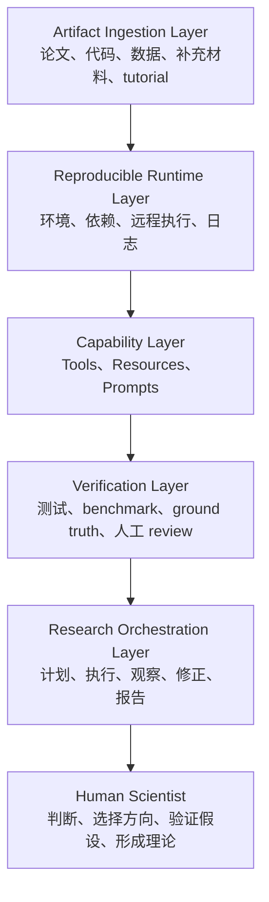

> 上一篇文章讨论的是：如何让 Agent 的判分可信。本文讨论的是：即使判分可信，我们如何判断排名、提升和结论是否可信。

## 摘要

Agent 评估中最常见、也最危险的误解之一，是把平均分直接当成能力差异。一个评测报告写着 Agent A 得分 83%，Agent B 得分 86%，很多人会自然得出“B 更强”的结论。但从统计意义上看，这个结论并不自动成立。评估分数不是能力本身，而是一次有限样本上的估计；只要是估计，就必然带有不确定性。没有误差条的 eval 排名，本质上只是一个没有标注不确定性的估计。

因此，在阅读或构建 Agent 评估时，我们不应该只问“谁的 average score 更高”，而应该进一步追问：这个差距是否大过噪声，样本是否足够，是否使用了 paired comparison，置信区间是否跨过 0，失败到底来自模型能力，还是来自工具链、环境、评分器或运行时策略。对于多步骤、异步、工具密集的 Agent 系统，这些问题尤其重要，因为 Agent 的失败往往不是单一模型能力的失败，而是整条系统链路中某个环节的随机扰动或结构性缺陷。

这篇文章可以看作《Trace 与 Eval：面向复杂 Agent 系统的可信评估方法论》的姐妹篇。上一篇关注的是 Outcome Validity：我们凭什么相信评分器给出的分数是真的。本文关注的是 Statistical Validity：当我们已经有了相对可信的分数，如何判断这些分数之间的差异是否足以支持决策。换句话说，可信评估不只需要证据链，还需要误差条；不只需要 evaluator validation，还需要 uncertainty quantification。

## 一、可信判分之后，还需要可信比较

在复杂 Agent 项目中，评估通常承担非常具体的决策功能。我们可能要决定是否上线一个新模型，是否回滚一个 planner，是否替换检索工具，是否把一个 prompt 改动合入主分支，或者是否在论文中报告某个 agent architecture 优于 baseline。所有这些决策都依赖比较，而比较不是简单地看谁的分数高。

原因很简单：每一次 eval 都只是在有限任务、有限运行次数、有限环境条件下观察到的一组样本。即使评分器本身是可信的，样本均值也会受到任务抽样、模型随机性、工具环境、评分噪声和 benchmark 污染的影响。一个 3% 的提升可能代表真实能力差异，也可能只是刚好抽到一批更适合某个模型的任务，刚好命中了某种 prompt 偏好，刚好某些题被模型见过，或者刚好测试环境对某个 agent 更友好。

因此，Agent eval 报告至少应该区分两个层面的可信度。第一层是判分可信度，也就是上一篇文章讨论的 Trace、Eval、Validation：事实记录是否真实，评分器是否可靠，判分是否有证据支撑。第二层是比较可信度，也就是本文讨论的误差条、置信区间、配对比较和信噪比：即使每道题的分数都可信，整体差异是否足以支持“更强”“更稳”“可以上线”这样的结论。

如果没有第二层，评估报告很容易变成排行榜幻觉。它看起来精确到小数点后一位，但实际上没有告诉我们这个数字会晃动多少，也没有说明观察到的差距是否大过统计噪声。

## 二、小而难的 Benchmark 也可能不可靠

很多人会认为，小而难的 benchmark 更有价值，因为它们避免了大量简单题带来的虚假高分。这种直觉有一部分道理，但不完整。难题可以提高任务的挑战性，却不自动提高统计测量质量。一个 benchmark 是否可靠，不只取决于题目难不难，还取决于样本量、评分粒度、题目独立性、模型表现一致性，以及它是否能稳定区分被测系统。

以 HumanEval 为例，它只有 164 道题。如果模型 A 比模型 B 高 3%，这大约只相当于多做对 5 道题：

```text
164 * 3% ≈ 5
```

这 5 道题可能确实代表能力差异，但也可能来自偶然性。它可能是训练分布差异、采样运气、prompt 偏好、题目泄漏、测试环境差异或评分器细节造成的。样本量越小，几个样本就越容易改变结论。因此，小 benchmark 的核心风险不是“不重要”，而是“一次测量太容易被偶然性影响”。

难题还存在另一个问题：复杂不等于高信息量。许多 code、agent 或 generative benchmark 的任务很复杂，一个样本可能消耗大量 token、调用多个工具、运行很长时间，但最终评分仍然只是 `pass/fail`。这意味着一个复杂任务在统计上只贡献了一个二值观测。它告诉我们系统最终过了或没过，却没有充分告诉我们失败发生在哪里：是规划错了，检索错了，工具调用失败了，验证器误判了，还是输出格式不合规。

这对于 Agent 评估尤其致命。Agent 任务通常由多个步骤组成：理解任务、制定计划、检索信息、调用工具、执行代码、读取结果、修复错误、输出答案。如果每一步成功率都是 95%，十步都成功的概率只有：

```text
0.95^10 ≈ 60%
```

因此，一个复杂 Agent 样本失败，并不一定说明模型缺少目标能力。它也可能是路径依赖、工具失败、timeout、依赖环境异常、retry 策略不一致、verifier 误判或上下文污染造成的。难题如果只给一个二值结果，就会把这些不同失败来源压缩成同一个 0，从而损失大量诊断信息。

## 三、标准误：平均分本身有多不稳

要让 eval 报告从“分数展示”走向“统计估计”，第一步是报告标准误。标准误回答的问题是：如果我们重新抽一批类似任务，平均分大概会晃动多少。

假设一个 eval 有 `n` 个任务，每个任务得分为：

```text
s1, s2, ..., sn
```

平均分为：

```text
mean = (s1 + s2 + ... + sn) / n
```

标准误可以写成：

```text
SE = sample_std(scores) / sqrt(n)
```

如果每题只是答对或答错，可以用 Bernoulli 近似：

```text
SE ≈ sqrt(p * (1 - p) / n)
```

其中，`p` 是通过率，`n` 是任务数量。这个公式的直觉很重要：样本越少，标准误越大；通过率越接近 50%，不确定性越大；只有增加有效样本量，平均分才会更稳定。

例如，一个模型在 100 道题上的准确率是 80%：

```text
p = 0.8
n = 100

SE = sqrt(0.8 * 0.2 / 100)
   = sqrt(0.0016)
   = 0.04
```

这意味着报告不应该只写 `accuracy = 80%`，而应该理解为 `accuracy = 80%, SE ≈ 4%`。这个 80% 不是一个无误差的能力常数，而是一次有限样本估计。对于 Agent benchmark 来说，如果样本数更少、任务更相关、运行更随机，实际不确定性还可能更大。

## 四、置信区间：真实能力可能落在哪个范围

标准误进一步可以转化为置信区间。常见做法是报告 95% confidence interval：

```text
95% CI = mean ± 1.96 * SE
```

接着上面的例子：

```text
mean = 0.80
SE = 0.04

95% CI = 0.80 ± 1.96 * 0.04
       = 0.80 ± 0.0784
       = [0.7216, 0.8784]
```

也就是说，观察到的 80% 可以报告为：

```text
80% [72.2%, 87.8%]
```

这个区间提醒我们：100 道题并不一定足以支撑非常精细的排名。如果另一个模型得分是 83%，单看均值似乎更高，但两个区间可能高度重叠。此时更严肃的问题不是“谁高 3%”，而是“这个差异是否能从抽样噪声中分离出来”。

这里需要注意，置信区间并不是 eval 的全部不确定性。它通常只处理样本抽样带来的统计不确定性，而 Agent 系统还存在运行随机性、评分器不确定性、环境不确定性和任务聚类相关性。因此，在复杂 Agent 系统中，报告置信区间是最低要求，而不是最高标准。

## 五、比较两个 Agent：不能只看两个平均分

最常见的错误报告形式是：

```text
Agent A: 83%
Agent B: 86%
Conclusion: B wins
```

这个结论缺少一个关键问题：3% 的差距是否大过噪声。如果差距小于误差范围，就不能可靠地说 B 更强。

在最粗糙的情况下，如果两个系统不是在同一批任务上比较，或者我们只拿到了两个独立平均分，可以使用 unpaired comparison：

```text
SE_diff = sqrt(SE_A^2 + SE_B^2)
diff = mean_A - mean_B
95% CI_diff = diff ± 1.96 * SE_diff
```

例如：

```text
A = 83%, SE_A = 3%
B = 86%, SE_B = 3%

diff = A - B = -3%
SE_diff = sqrt(3%^2 + 3%^2) = 4.24%

95% CI_diff = -3% ± 1.96 * 4.24%
             = -3% ± 8.31%
             = [-11.31%, 5.31%]
```

这个区间包含 0，因此不能可靠地说 B 更强。B 的平均分确实高，但这个高分还没有足够证据排除噪声解释。

不过，对于 Agent 比较，更推荐的方法通常是 paired comparison。也就是说，让两个 Agent 跑同一批任务，并逐题比较差值：

```text
di = score_A_i - score_B_i
mean_diff = average(d1, d2, ..., dn)
SE_paired = sample_std(differences) / sqrt(n)
95% CI_diff = mean_diff ± 1.96 * SE_paired
```

Paired comparison 的优势在于控制了题目难度。同一道题上比较 A 和 B，实际上是在问：在这个具体问题上，A 是否比 B 更好。特别简单的题如果两个系统都对，对区分能力贡献不大；特别难的题如果两个系统都错，也不太提供比较信息。真正重要的是 A 对 B 错、或 A 错 B 对的样本。因此，paired comparison 通常比只比较两个总平均分更有统计效率，也更适合 Agent 系统的 A/B 测试。

判断规则可以很简单：如果 `CI_diff` 包含 0，不能确定谁更好；如果 `CI_diff` 全部大于 0，A 的提升较可信；如果 `CI_diff` 全部小于 0，B 的提升较可信。这个规则比“均值高者获胜”保守，但也更接近科研和工程决策所需要的可靠性。

## 六、Signal-to-Noise Ratio：差异是否大过噪声

除了置信区间，还可以用 signal-to-noise ratio 来理解 benchmark 是否能区分模型：

```text
signal_to_noise = |A - B| / SE(A - B)
```

其中，`|A - B|` 是观察到的模型差距，`SE(A - B)` 是这个差距本身的不确定性。如果差距没有明显大过噪声，排行榜变化就不应该被过度解读。一个简单经验规则是：

```text
signal_to_noise < 2：通常不能可靠测出提升
signal_to_noise >= 2：差异开始更可信
```

这个规则和 95% 置信区间是否跨过 0 的直觉一致。对于产品评估，它还有一个很实际的意义：如果预期提升只有 2% 到 3%，而 benchmark 的标准误已经是 4% 到 5%，那么这个 benchmark 根本不适合支持这类小幅决策。此时需要增加样本量、提高评分粒度、做 paired comparison，或者换一个更贴近目标差异的 benchmark。

## 七、Agent 评估的不确定性来源比普通模型更多

传统模型 benchmark 的主要不确定性来自样本抽样和模型输出随机性。Agent 系统更复杂，因为它引入了工具、环境、调度、状态和外部依赖。一个 Agent 的失败可能来自任务理解，也可能来自规划、检索、工具调用、代码执行、环境依赖、验证器、记忆污染、上下文压缩、超时、成本限制或权限边界。

因此，Agent eval 不能把所有失败都归因于“模型不行”。每个失败样本至少应该进行错误分类，例如理解任务失败、规划失败、检索失败、工具调用失败、代码执行失败、环境或依赖失败、验证器失败、记忆污染、上下文污染、超时、成本过高、输出格式不合规、安全边界失败等。只有这样，统计差异才有解释力。

例如，Agent B 比 Agent A 高 4%，但错误分析显示 B 的优势主要来自更宽松的 retry 策略，而不是更强的推理能力。此时把结论写成“B 的模型更强”就是错误归因。更准确的结论可能是“B 的运行时策略在当前工具环境下更稳定”。同样，如果一个新版本分数下降，原因可能不是模型退化，而是 verifier 变严格、工具依赖失败、或者 benchmark 中某个 cluster 出现环境问题。

这也解释了为什么每道题必须保留 trace。没有 trace，评估报告只能看到分数变化，看不到变化来源。对于 Agent 系统，最终分数只是入口，真正的诊断来自每题的任务、cluster、agent version、model version、prompt version、tool config、score、error type、latency、token cost、tool calls 和 trace path。

## 八、样本独立性：任务数量不等于有效样本量

许多 eval 报告会强调 `n_tasks`，但任务数量并不总等于有效样本量。如果 100 道题来自同一个 repo、同一篇文档、同一个用户任务或同一类模板，那么它们之间并不独立。模型在其中一道题上的表现，很可能预测它在同 cluster 其他题上的表现。

这种情况下，直接按 100 个独立样本计算标准误，会低估不确定性。更稳妥的报告应该同时记录 `n_tasks` 和 `n_clusters`，并尽量在 cluster 层面做稳健估计。如果一个 benchmark 有 500 个样本，但只有 20 个真正不同的任务簇，那么它对系统泛化能力的支撑远弱于表面样本数。

对于 Agent 产品评估，cluster 的定义可以很实际：同一代码仓库、同一用户工作流、同一数据源、同一论文、同一工具链、同一错误模式，都可能构成 cluster。报告中至少应该标出这些聚类结构，而不是只给总样本数。

## 九、报告格式：从排行榜到决策证据

一个合格的 Agent eval 报告，不应该只展示平均分，而应该展示足以支持决策的证据结构。对于单个 Agent，每个 benchmark 至少应该报告：

```text
benchmark
n_tasks
n_clusters
mean_score
standard_error
95% confidence_interval
cost
latency
```

如果是通过率，可以使用：

```text
SE ≈ sqrt(p * (1 - p) / n)
```

如果是连续分，则使用：

```text
SE = sample_std(scores) / sqrt(n)
```

对于两个 Agent 的比较，应该优先报告 paired comparison：

```text
di = score_B_i - score_A_i
mean_diff = average(di)
SE_diff = sample_std(differences) / sqrt(n)
95% CI_diff = mean_diff ± 1.96 * SE_diff
```

同时，报告中还应该包含 error breakdown。一个分数差异如果没有错误分类，就很难转化为工程行动。比如，提升来自检索召回、工具恢复、输出格式、成本控制还是证据 grounding，对后续迭代方向完全不同。

最终结论也应该分级，而不是简单写“提升明显”。我建议使用四档：

| 结论等级 | 含义 |
| --- | --- |
| Confirmed | 置信区间不跨 0，多个 benchmark 方向一致，错误分析支持结论 |
| Suggestive | 方向一致，但样本量或误差条还不够强 |
| Inconclusive | 分数有差异，但置信区间跨 0，不能确认 |
| Invalid | 实验设置、数据泄漏、评分规则或环境不可靠 |

这种分级能迫使评估报告从“给排行榜”转向“给决策证据”。对于上线、回滚、论文实验和模型选择，这种保守性不是缺点，而是必要的科学纪律。

## 十、Paper2Agent：科研 Agent 为什么更需要统计评估

到这里为止，文章主要讨论“如何判断一个 Agent 的结果是否可靠”。但如果我们把视角放到科研 Agent，问题还要再推进一步：一个科研 Agent system 应该被设计成什么样，才值得被评估。

Paper2Agent 提供了一个很好的例子。它的核心不是让 AI 更会读论文，而是把论文转换成一个可调用、可复现、可测试、可部署、可组合的科研执行单元。传统科研成果通常是：

```text
paper + GitHub repo + supplementary files
```

而 Paper2Agent 试图推动的形态是：

```text
paper + code + data + workflow + tests + MCP server + agent interface
```

也就是说，一篇论文不只是被阅读，而是被封装成一个可以交互、可以执行、可以被其他 Agent 调用的 paper agent。这个转变非常重要，因为它让科研评估从“回答得像不像专家”走向“方法是否能被正确执行、复现、组合和验证”。

## 十一、Paper Agent 的能力边界：Tools、Resources 与 Prompts

Paper2Agent 的核心机制，是把论文转换成一个 MCP server。一个 paper agent 通常包含三类对象：Tools、Resources 和 Prompts。

Tools 是把论文里的方法封装成可调用函数。以 AlphaGenome 这类方法为例，工具可以执行 genetic variant scoring，预测 gene expression、splicing、chromatin accessibility 等影响，生成可视化图，批量处理 variants，查询 ontology，并输出结构化结果。这里的关键不是“Agent 会写代码”，而是 Agent 有一组经过验证、来自论文代码库的工具可以调用。这会显著降低 LLM 临时生成科研代码的风险。

Resources 是论文相关的静态资源库，包括论文正文、官方代码、补充材料、数据集、表格、图、metadata、data availability 和分析数据链接。科研 Agent 不能只有工具，因为工具告诉它如何执行，却不一定告诉它背景、边界和证据来源。Resources 提供的是方法语境和可追溯性。

Prompts 在这里也不是普通聊天提示词，而是可复用科研 workflow。许多科研分析不是随机调用工具，而是有相对稳定的流程。例如单细胞分析通常需要质量控制、normalization、高变基因选择、PCA、邻域图构建、聚类、cell-type annotation、可视化和结果总结。如果只暴露工具，Agent 可能不知道正确顺序；如果每次都让用户手写流程，系统门槛又太高。因此，workflow prompt 或 workflow graph 是科研 Agent 能否稳定执行复杂分析的关键。

这三类对象也对应评估中的三个问题：Tools 是否通过复现测试，Resources 是否完整且可追溯，Prompts 是否让 Agent 按正确流程执行。任何一个层面不可靠，最终科研 Agent 的分数都可能失去解释力。

## 十二、科研 Agent 的评估对象不是回答，而是可执行系统

普通论文问答系统的边界是：用户问问题，Agent 从论文中找答案，然后用自然语言解释。科研 Agent 的边界则更高：用户提出科研任务，Agent 调用论文工具和数据，执行分析，生成可验证结果，并解释科学含义。

因此，科研 Agent 的最低标准不是“讲得清楚”，而是能否把论文里的方法可靠地应用到新数据或新问题上。这要求系统至少具备稳定工具层、可复现环境、verifier、traceability 和 workflow orchestration。

稳定工具层意味着科研 Agent 不能每次都让 LLM 现场写代码。更可靠的做法是从论文代码库抽取工具，封装成单一职责函数，明确输入输出，参数化，测试通过后锁定，运行时让 Agent 调用这些工具。可复现环境则要求 isolated workspace、dependency lock、container 或 remote server、import check、example execution、logs 和 artifact management。没有这一层，科研 Agent 很容易变成只能在作者电脑上跑的 demo。

Verifier 是科研 Agent 可靠性的核心。它需要检查工具是否复现 tutorial，数值结果是否一致，图是否一致，输出格式是否稳定，新输入是否落在工具能力范围内，失败时是否清楚报告而不是编造。没有 verifier 的科研 Agent，本质上只是高风险自动化。

Traceability 则要求每个工具和结果都能追溯到论文、代码文件、数据集、参数、运行时间、生成 artifacts、测试状态、假设和限制。科研场景中，Agent 的可信度不来自语气，而来自证据链。

## 十三、科研 Agent 的五层架构

如果要设计一个可评估的科研 Agent system，可以把它分成五层：



Artifact Ingestion Layer 负责接收和解析论文、GitHub repo、README、tutorial、notebook、supplementary tables、figures、data availability、API 文档和 benchmark examples。它的目标不是摘要，而是把科研材料转化为 Agent 可用的结构化对象。

Reproducible Runtime Layer 负责让科研代码真的能跑，包括 dependency resolution、环境管理、API key、数据下载、缓存、文件输出、运行约束和远程部署。Capability Layer 则包含 Tools、Resources 和 Prompts，它们分别提供执行能力、知识资源和工作流结构。

Verification Layer 决定什么能力可以进入系统。它应该包括 tutorial reproduction tests、numerical output comparison、figure reproduction checks、novel query tests、human expert grading、failure logging、cost/runtime recording 和 regression tests。Research Orchestration Layer 才是用户看到的 Agent 层，负责理解任务、制定计划、选择工具、调用多个 MCP、观察结果、修正策略、生成报告，并标注证据与不确定性。

这套架构的意义在于，它让科研 Agent 的评估对象从“单次回答”变成“可执行、可验证、可追溯的系统能力”。也只有在这个前提下，误差条、paired comparison 和 error breakdown 才有真正意义。

## 十四、把可信评估与科研 Agent 合在一起看

上一篇文章给出的核心结论是：Agent 评估必须让 Trace、Eval 和 Validation 分层，使判分具有证据基础，并让评分器自己被验证。本文进一步补上的结论是：即使判分可信，评估报告也必须标注统计不确定性。没有误差条，就无法判断排名是否可靠；没有 paired comparison，就难以区分真实提升和任务噪声；没有 error breakdown，就无法知道失败来自模型、工具、环境还是评分器。

Paper2Agent 这样的科研 Agent 让这两个问题汇合在一起。科研 Agent 的能力必须来自稳定工具、可复现环境、workflow、verifier 和 evidence trail；科研 Agent 的评估必须来自可验证判分、置信区间、配对比较、样本独立性和失败类型分析。合起来可以概括为：

```text
可靠科研 Agent = 可执行系统 + 可验证能力 + 可统计评估
```

因此，我们以后评估一个科研 Agent，不能只问它回答得像不像专家，而要问：它调用了什么工具，工具是否通过复现测试，环境是否可复现，输入输出是否结构化，失败是否可追踪，分数差异是否超过噪声，结论是否区分 observed output、interpretation、hypothesis 和 validation needed。

## 十五、最终报告模板

下面是一份更适合 Agent 项目的 eval 报告模板：

```markdown
## Evaluation Question

我们比较的是：

决策目标是：

最小有效提升是：

## Setup

Agent A:

Agent B:

Benchmark:

n_tasks:

n_clusters:

Runs per task:

Scoring rule:

Evaluator version:

## Results

| Benchmark | Agent A | SE A | Agent B | SE B | Diff | SE Diff | 95% CI Diff | Conclusion |
|---|---:|---:|---:|---:|---:|---:|---:|---|

## Error Breakdown

| Error Type | Agent A | Agent B | Notes |
|---|---:|---:|---|

## Reliability

pass@k:

pass^k:

Cost:

Latency:

Trace coverage:

## Decision

Conclusion: Confirmed / Suggestive / Inconclusive / Invalid

上线建议：

主要风险：

下一轮需要补的实验：
```

这份模板的目标不是让报告更复杂，而是让结论更诚实。它迫使我们说明比较对象、决策目标、样本规模、聚类结构、评分规则、误差条、失败类型和结论等级。一个 eval 报告只有回答这些问题，才真正有资格支持工程或科研决策。

## 结语：Eval 分数不是事实，而是带不确定性的测量

Agent eval 的最终目标，不是制造一个更漂亮的排行榜，而是为决策提供可信证据。上一篇文章强调，可信评估需要 Trace、Eval 和 Validation：事实记录要可信，判分要有证据，评分器本身要被验证。本文强调的是另一半：即使分数可信，分数之间的差异也必须经过统计检验。

没有误差条的 eval 排名，只是没有标注不确定性的估计。没有 paired comparison 的模型比较，很可能把题目噪声误当成能力差异。没有 error breakdown 的分数提升，很可能把工具链、环境或评分器变化误归因给模型。对于复杂 Agent 系统，尤其是科研 Agent，这些问题不是统计洁癖，而是可靠性工程的基本要求。

因此，下一次看到 Agent 排行榜时，我们不应该只问谁的平均分更高，而应该问：这个差距是否大过噪声，置信区间是否跨 0，样本是否独立，评分器是否可信，失败是否分类，trace 是否可复查，结论是否足以支持实际决策。只有当这些问题都有答案时，eval 才不只是跑分，而开始接近科学测量。
